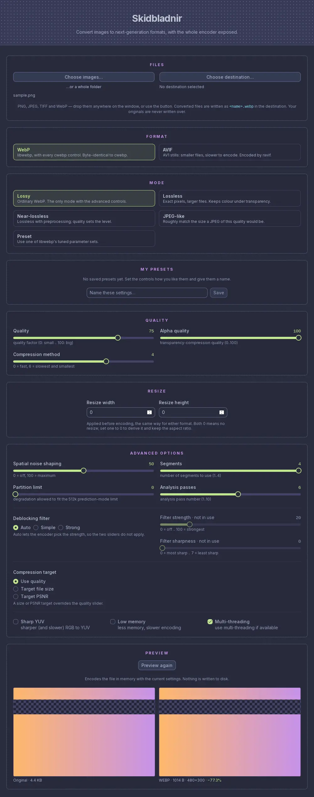

# Skidbladnir

A desktop GUI for converting images to next-generation open-source formats — **WebP**
and **AVIF**. For WebP it drives libwebp with `cwebp`'s full control surface — not just a
quality slider — so you can tune an encode the way the command-line tool allows,
without memorising the command line.



*The Tauri app. The Electron app it replaces looks different; see Status below.*

## Features

**Output formats**

- **WebP**, through libwebp, byte-for-byte identical to `cwebp` at the same settings
- **AVIF** (Tauri app only), through `ravif`: quality, alpha quality, speed, 8- or 10-bit,
  YCbCr or RGB, and what happens to colour under transparency

**WebP encoding modes**

- Lossy, lossless, near-lossless and JPEG-like modes
- Built-in presets: default, photo, picture, drawing, icon, text
- Quality and alpha-quality control
- Target file size or target PSNR instead of a fixed quality

**Expert controls**

- Compression method and segment count
- Spatial noise shaping (SNS)
- Filter strength, filter sharpness, strong/simple filtering and auto-filter
- Multi-pass encoding
- Partition limit
- Sharp YUV (higher-quality RGB→YUV conversion)
- Low-memory mode
- Resize on the way out (width and height)
- Multi-threading

**Workflow**

- Preview the result beside the original, in either format, before anything is written
  (Tauri app only)
- Batch conversion across multiple input files
- Original and converted file sizes reported after each conversion
- Advanced options hidden behind a disclosure so the common path stays simple

## Install

Grab a build from the [releases page](https://github.com/basic-automation/Skidbladnir/releases).

Two applications are released from this repository while the migration is under way:

- **The Electron app** — the one to use for production work. Windows only; the last
  release of it is v0.4.3.
- **The Tauri app** — the rewrite, released as a **prerelease**: a Linux `.deb` and
  AppImage, a Windows installer and an Apple Silicon macOS `.dmg`. See Status for which
  of those have actually been run.

Each release says which of the two it contains.

## Build from source

The repository currently holds two applications: the Electron app that ships today,
and the Rust + Tauri 2 app replacing it. Both build from a clean checkout.

### The Tauri app (in progress)

Requires a stable Rust toolchain, Node.js and npm. On Linux you also need
`webkit2gtk-4.1` and its development headers.

```bash
cargo install tauri-cli --locked --version '^2'
npm --prefix frontend install
cargo tauri build --no-bundle
```

Run it from the workspace root with `cargo tauri dev`, which starts the Nuxt dev
server and the window together. Release builds must go through `cargo tauri build`
rather than `cargo build --release`: the `custom-protocol` feature that embeds the
frontend is only enabled by the former.

The encoder is libwebp itself, linked into the binary — there is no `cwebp` to
download and no subprocess.

### Checking a build

```bash
cargo test --workspace     # includes the encoder-parity tests
scripts/smoke-test.sh      # drives the built window: renders, IPC, a real conversion
scripts/a11y-audit.sh      # axe-core against the live window
```

The parity tests compare this encoder against a real `cwebp` and require one: point
`SKIDBLADNIR_REFERENCE_CWEBP` at a build of the **same libwebp version** the binary links
(`cargo run --example libwebp-version -p skidbladnir-encode` prints it), or they will say
so and skip rather than pass quietly. Set `SKIDBLADNIR_REQUIRE_PARITY=1` to turn a skip
into a failure.

The two scripts need `tauri-driver` (`cargo install tauri-driver`) and `WebKitWebDriver`
(`webkit2gtk-driver` on Debian/Ubuntu, `webkitgtk-6.0` on Arch). They skip, loudly, when
those are missing.

### The Electron app (shipping today)

Requires Node.js and npm.

```bash
npm install
```

It shells out to the `cwebp` binary, which is not vendored in this repository.
Download the [WebP precompiled
binaries](https://developers.google.com/speed/webp/docs/precompiled) and place
`cwebp.exe` at `./resources/win/bin/cwebp.exe`.

Then:

```bash
npm start          # run the app
npm run dist       # build a distributable into ./dist
```

## Status

The Electron app remains the shipping application. The **Rust + Tauri 2** rewrite,
with a **Nuxt + Tailwind** frontend and targeting Windows, Linux and macOS, now has a
working window and a complete encode core; the work queue lives in
[ROADMAP.md](ROADMAP.md).

What the new app can already do:

- Encode with libwebp linked directly into the binary, exposing every control listed
  above — and its output is **byte-for-byte identical to `cwebp`** across 76 settings
  spanning the whole control surface, verified by a test that runs both encoders on the
  same pixels and compares the result.
- Convert images from a window with **every encoder control above** exposed, grouped
  the way the Electron app grouped them, with the advanced controls behind a
  disclosure and shown only for the mode that actually uses them.
- Accept files dropped onto the window, sorting out the ones it cannot read by looking
  at their contents rather than their file extension.
- Convert a batch of files, showing progress per file, with a Cancel button that stops
  without leaving a half-converted image behind.
- Convert a whole folder, including subfolders, recreating its structure in the
  destination.
- Write **AVIF** as well as WebP, with its own panel of controls. Each format keeps its
  own settings while you try the other. AVIF output is checked by decoding it with
  libavif's own `avifdec`, measuring how close the pixels come back, and confirming
  transparency survives.
- Preview the result beside the original, in either format, before anything is
  written to disk.
- Tell you what an existing WebP already is — size, lossy or lossless, alpha — and say
  plainly when a file is an animation it cannot re-encode, rather than failing obscurely.
- Remember your settings and destination between launches, and save named presets of
  your own.
- Be driven entirely from the keyboard, with every control labelled for a screen reader.
- Look like Skidbladnir: the original layout — dot-textured header and footer bands,
  dotted option groups, two-column controls and the circular action button — restyled
  in the Palenight palette.
- Read PNG, JPEG, TIFF and WebP input, identifying the format by its contents rather
  than by its file extension. That includes **CMYK JPEGs** as Photoshop writes them,
  which `cwebp` itself refuses to read.
- Refuse to overwrite your source image, and stage every write through a temporary
  file so a failed conversion cannot damage a file that was already there.
- Report the before and after sizes, and the dimensions actually produced.
- Build and pass its tests on Windows, Linux and macOS in CI.

Known gaps:

- The Windows installer and the macOS `.dmg` are built by CI but **have never been
  launched** by anyone — treat them as untested. The macOS build is for Apple Silicon
  only; there is no Intel build. The Linux `.deb` and AppImage have been run.
- No AppImage is produced on the maintainer's machine, because bundling one needs
  `patchelf`, which is not installed there. CI has it.
- The app is not code-signed on any platform, and there is no auto-updater.
- The Electron app still requires a manually downloaded `cwebp.exe`, and it will
  silently overwrite your original if you convert a WebP into the folder it already
  lives in. The Tauri app refuses that conversion instead.
- AVIF encoding is slow at the default speed on large images, and it cannot be
  cancelled mid-file: the encoder reports no progress, so Cancel takes effect when the
  current file finishes (which is then discarded, not written). AVIF input is not read
  yet, and there is no chroma subsampling control — AVIF is always written 4:4:4.
- The AVIF **preview** needs a web engine that can display AVIF. On Linux, WebKitGTK is
  built without it on some distributions — Ubuntu 24.04's, which is also what the
  AppImage bundles — and there the window shows a notice in place of the encoded image.
  The AVIF files themselves are unaffected.
- JPEG XL is being watched until browsers enable it without a flag. The long-promised
  JPEG 2000 was dropped as a goal; it has no momentum outside medical and archival
  imaging.
- The Electron app looks different from the screenshot above, which is the Tauri app.

## License

ISC. See [LICENSE](LICENSE) if present, or the `license` field in `package.json`.
