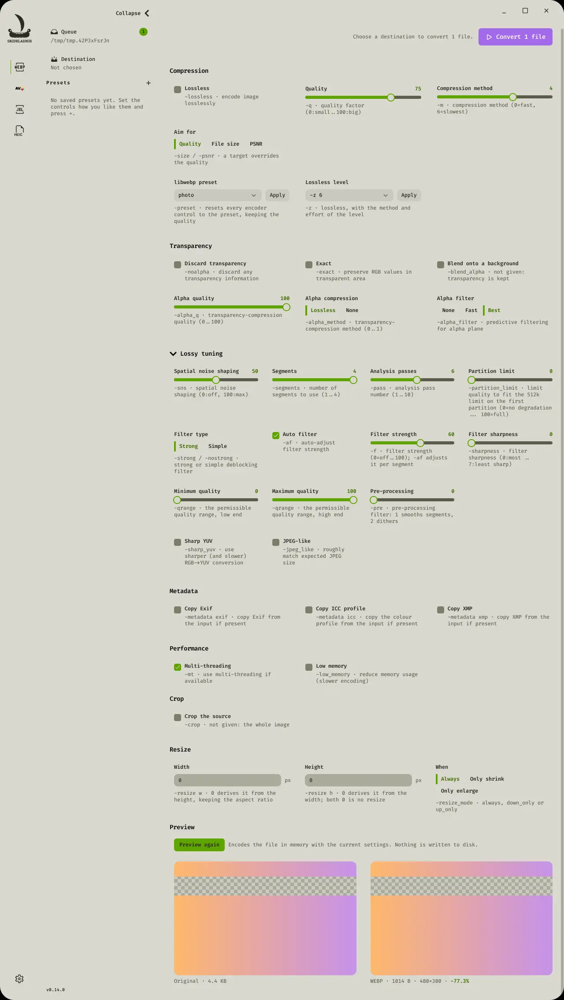
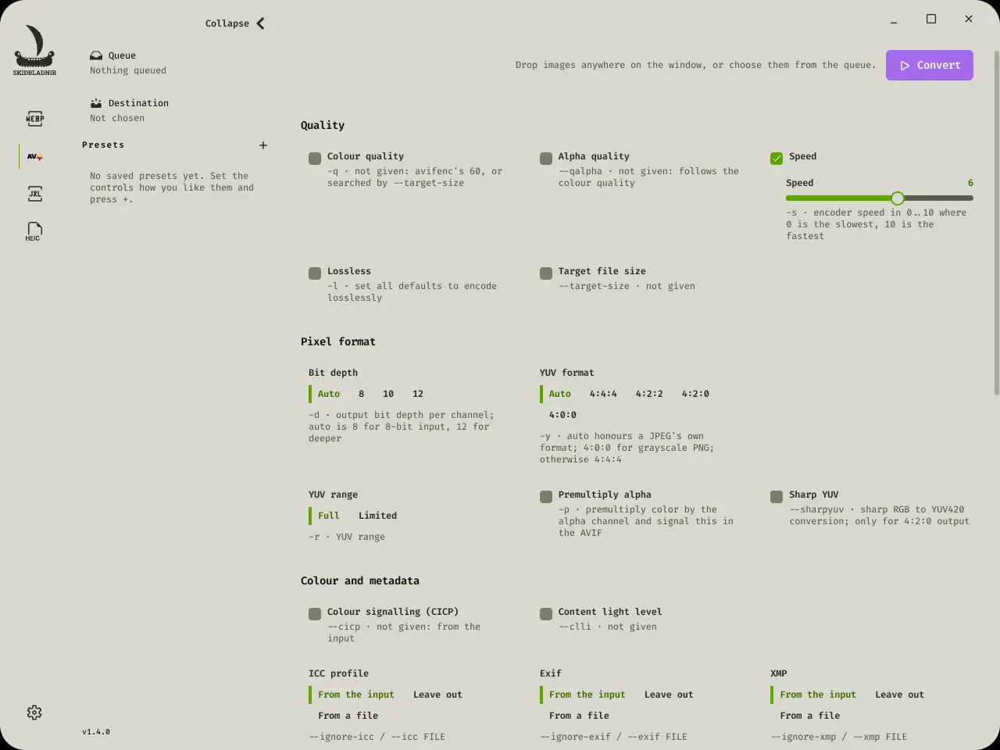

# Skidbladnir

A desktop GUI for converting images to next-generation formats — **WebP**, **AVIF**,
**JPEG XL** and **HEIC**. For WebP it drives libwebp with `cwebp`'s full control surface — not just a
quality slider — so you can tune an encode the way the command-line tool allows,
without memorising the command line.



*WebP selected, with a file previewed.*

<details>
<summary>With AVIF selected</summary>



</details>

## Features

**Input formats**

- PNG, JPEG (including Photoshop's CMYK), TIFF and WebP (including animated WebP)
- **AVIF**, and **GIF**, still or animated

**Output formats**

- **WebP**, through libwebp, byte-for-byte identical to `cwebp` at the same settings
- **AVIF**, through `ravif`: quality, alpha quality, speed, 8- or 10-bit,
  YCbCr or RGB, and what happens to colour under transparency
- **JPEG XL**, through libjxl, the reference encoder: quality, effort, lossless, and
  **lossless JPEG recompression** — a JPEG is repacked about 20% smaller without being
  decoded, and the original JPEG can be rebuilt from it bit for bit
- **HEIC**, the format iPhones use, through libheif with the Kvazaar HEVC encoder:
  quality, with transparency kept

**WebP encoding modes**

- Lossy, lossless, near-lossless and JPEG-like modes
- Built-in presets: default, photo, picture, drawing, icon, text
- Quality and alpha-quality control
- Target file size or target PSNR instead of a fixed quality

**Expert controls**

- Compression method and segment count
- Spatial noise shaping (SNS)
- Filter strength, filter sharpness, strong/simple filtering and auto-filter
- Multi-pass encoding
- Partition limit
- Sharp YUV (higher-quality RGB→YUV conversion)
- Low-memory mode
- Resize on the way out (width and height)
- Multi-threading

**Workflow**

- Preview the result beside the original, in either format, before anything is written
- Animated WebP or GIF in, animated WebP out, every frame kept
- Batch conversion across multiple input files
- Original and converted file sizes reported after each conversion
- Advanced options hidden behind a disclosure so the common path stays simple

## Install

Grab a build from the [releases page](https://github.com/basic-automation/Skidbladnir/releases).

Each release carries a Linux `.deb` and AppImage, a Windows installer, and macOS `.dmg`s
for Apple Silicon and Intel. Releases are still marked **prerelease**; see Status for
which builds have actually been run.

Once installed, Skidbladnir checks for a newer release each time it starts and offers it
in a banner; nothing is downloaded until you click **Install and restart**, and every
update is verified against the project's signing key before it is installed. A `.deb`
install updates with a `.deb` (and asks for your password to do it); an AppImage, the
Windows installer and the macOS app update themselves in place. Releases before 0.8.0
have no updater, so moving off them is a manual download, once.

Skidbladnir used to be an Electron app for Windows. That app has been retired: its last
binary release is [v0.4.3](https://github.com/basic-automation/Skidbladnir/releases/tag/v0.4.3)
(2019), and its last source is the
[`electron-final`](https://github.com/basic-automation/Skidbladnir/tree/electron-final) tag.

## Build from source

Requires a stable Rust toolchain, Node.js and npm, **`nasm`** — the AV1 encoder and
decoder and the JPEG decoder assemble their SIMD code with it (Arch: `nasm`; Debian/Ubuntu: `nasm`; macOS:
`brew install nasm`; Windows: `choco install nasm`) — and **CMake** with a C++ compiler,
which build libjxl from source so it is linked statically. HEIC needs libheif, built with
`scripts/build-libheif.sh` from the pinned sources in `third_party/` (clone with
`--recurse-submodules`); without that build, the system libheif is linked instead. On Linux you also need
`webkit2gtk-4.1` and its development headers.

Without CMake, the build links the system libjxl (0.11 or newer, with its development
files) through `pkg-config` instead, and says so. Set `SKIDBLADNIR_LIBJXL=vendored` to
insist on the static build, or `=system` to insist on the system library.

```bash
npm --prefix frontend install        # also installs the Tauri CLI
cd src-tauri && ../frontend/node_modules/.bin/tauri build --no-bundle
```

Run it with `../frontend/node_modules/.bin/tauri dev` from `src-tauri/`, which starts the
Nuxt dev server and the window together. Release builds must go through `tauri build`
rather than `cargo build --release`: the `custom-protocol` feature that embeds the
frontend is only enabled by the former.

The encoder is libwebp itself, linked into the binary — there is no `cwebp` to
download and no subprocess.

### Checking a build

```bash
cargo test --workspace     # includes the encoder-parity tests
scripts/smoke-test.sh      # drives the built window: renders, IPC, a real conversion
scripts/a11y-audit.sh      # axe-core against the live window
```

The parity tests compare this encoder against libwebp's own tools and require them:
point `SKIDBLADNIR_REFERENCE_CWEBP`, `SKIDBLADNIR_REFERENCE_IMG2WEBP` (animated WebP) and
`SKIDBLADNIR_REFERENCE_GIF2WEBP` (GIF) at builds of the **same libwebp version** the binary
links (`cargo run --example libwebp-version -p skidbladnir-encode` prints it). The AVIF
tests use libavif's `avifdec` from `PATH`. Missing tools make the tests say
so and skip rather than pass quietly; set `SKIDBLADNIR_REQUIRE_PARITY=1` to turn a skip
into a failure.

The two scripts need `tauri-driver` (`cargo install tauri-driver`) and `WebKitWebDriver`
(`webkit2gtk-driver` on Debian/Ubuntu, `webkitgtk-6.0` on Arch). They skip, loudly, when
those are missing.

## Status

Skidbladnir is a **Rust + Tauri 2** app with a **Nuxt + Tailwind** frontend, for Windows,
Linux and macOS. It replaced an Electron app, now retired. The work queue lives in
[ROADMAP.md](ROADMAP.md).

What it can do:

- Encode with libwebp linked directly into the binary, exposing every control listed
  above — and its output is **byte-for-byte identical to `cwebp`** across 76 settings
  spanning the whole control surface, verified by a test that runs both encoders on the
  same pixels and compares the result.
- Convert images from a window with **every encoder control above** exposed, grouped
  the way the Electron app grouped them, with the advanced controls behind a
  disclosure and shown only for the mode that actually uses them.
- Accept files dropped onto the window, sorting out the ones it cannot read by looking
  at their contents rather than their file extension.
- Convert a batch of files, showing progress per file, with a Cancel button that stops
  without leaving a half-converted image behind.
- Convert a whole folder, optionally including its subfolders and recreating their
  structure in the destination.
- Write **AVIF** as well as WebP, with its own panel of controls. Each format keeps its
  own settings while you try the other. AVIF output is checked by decoding it with
  libavif's own `avifdec`, measuring how close the pixels come back, and confirming
  transparency survives.
- Write **JPEG XL**, ahead of browsers enabling it by default, so a library can be
  converted in anticipation. JPEGs are recompressed losslessly by default. JPEG XL output
  is checked by libjxl's own `djxl`: it must decode our files at the right size and
  alpha, lossless files exactly, and rebuild a recompressed JPEG byte for byte.
- Preview the result beside the original, in any format, before anything is written to
  disk. AVIF and JPEG XL previews are decoded in Rust, so they show on every web engine.
- Tell you what an existing WebP already is — size, lossy or lossless, alpha, animated.
- Re-encode an **animated WebP** as an animated WebP, keeping every frame, its timing and
  its loop count, with every WebP setting applied to each frame, and preview it as an
  animation before converting. Its output is byte-for-byte identical to libwebp's own
  `img2webp` for every setting `img2webp` can express.
- Convert **GIFs**, still or animated, to WebP exactly as libwebp's own `gif2webp` does —
  byte for byte, across disposal methods, transparency, timing and loop counts.
- Remember your settings and destination between launches, and save named presets of
  your own.
- Be driven entirely from the keyboard, with every control labelled for a screen reader.
- A frameless window with a format rail, a sidebar for the queue, destination and
  presets, and one column of settings with Convert at its head.
- Write **HEIC** through libheif with Kvazaar, a BSD-licensed HEVC encoder, and read
  HEIC input with libde265. libheif ships as a separate shared library beside the app,
  with its codec plugins switched off, so it can never pick up a GPL encoder from your
  system. Checked by the runner's own libheif (`heif-dec`), a separate build.
- Read PNG, JPEG, TIFF, WebP, **AVIF**, **JPEG XL**, **HEIC** and **GIF** input,
  identifying the format by its contents rather than by its file extension. That
  includes **CMYK JPEGs** as Photoshop writes them, which `cwebp` itself refuses to read.
  AVIF input is checked against libavif's own `avifdec` across 17 colour encodings (bit
  depths, chroma subsampling, range, colour matrices, alpha), and an AVIF's crop,
  rotation and mirror are applied, so a sideways-stored portrait converts upright. Tiled
  (grid) AVIFs, as some cameras write large captures, are decoded whole. JPEG
  XL input is checked against libjxl's `djxl`.
- Keep a photo's **ICC colour profile, EXIF and XMP** in the WebP it becomes, if you ask —
  exactly as `cwebp -metadata` does, checked against `cwebp` itself. Off by default, as
  in `cwebp`: without the profile a wide-gamut (Display P3, Adobe RGB) photo's colours
  are read as sRGB. JPEG XL output keeps them too, the profile labelling the image,
  checked by libjxl's own `djxl`.
- Convert **JPEG, PNG, TIFF and WebP files to WebP byte for byte as `cwebp` itself
  would**, across every setting, checked against `cwebp` in CI: JPEGs are decoded with
  libjpeg-turbo's decoder, as `cwebp` decodes them, 16-bit files are reduced to 8 bits
  the way `cwebp`'s libpng or libtiff reduces them, and WebP sources take `cwebp`'s route
  straight to YUV. One deliberate exception: a TIFF with straight (unassociated) alpha
  keeps its colours, where `cwebp` darkens its semi-transparent pixels.
- Refuse to overwrite your source image, and stage every write through a temporary
  file so a failed conversion cannot damage a file that was already there.
- Report the before and after sizes, and the dimensions actually produced.
- Build and pass its tests on Windows, Linux and macOS in CI.

Known gaps:

- The macOS `.dmg`s (Apple Silicon and Intel) are built by CI but **have never been
  launched** — treat them as untested. The Windows installer is installed and exercised
  by CI on every change, and the Linux `.deb` and AppImage have been run.
- No AppImage is produced on the maintainer's machine, because bundling one needs
  `patchelf`, which is not installed there. CI has it.
- The app is not code-signed on any platform.
- An AVIF, JPEG XL or HEIC encode cannot be cancelled mid-file: none of those encoders reports progress, so
  Cancel takes effect when the current file finishes (which is then discarded, not
  written). There is no chroma subsampling control — AVIF is always written 4:4:4 —
  animated AVIF is not read.
- Metadata is kept in still WebP and JPEG XL output only: not in animations, and not
  yet in AVIF or HEIC output.
- An animation (animated WebP or GIF) converts to WebP only. AVIF, JPEG XL and HEIC
  output refuse it by name rather than keeping just the first frame, because those
  encoders write still images here. A target size or PSNR applies to each frame of an
  animation, not to the whole file.
- JPEG XL files open in Safari, and in Firefox and Chrome as each enables it by default;
  until then, most web pages cannot show them. The long-promised JPEG 2000 was dropped
  as a goal; it has no momentum outside medical and archival imaging.
- HEIC is HEVC, which is covered by patent pools; Skidbladnir ships an open-source HEVC
  encoder and decoder as GIMP, ImageMagick and ffmpeg do. HEIC is written 4:2:0, so there
  is no lossless HEIC.

## License

ISC, as declared in the workspace `Cargo.toml`. The native libraries it ships, and their
licences, are listed in [THIRD-PARTY-NOTICES.md](THIRD-PARTY-NOTICES.md), which every
installer includes.
